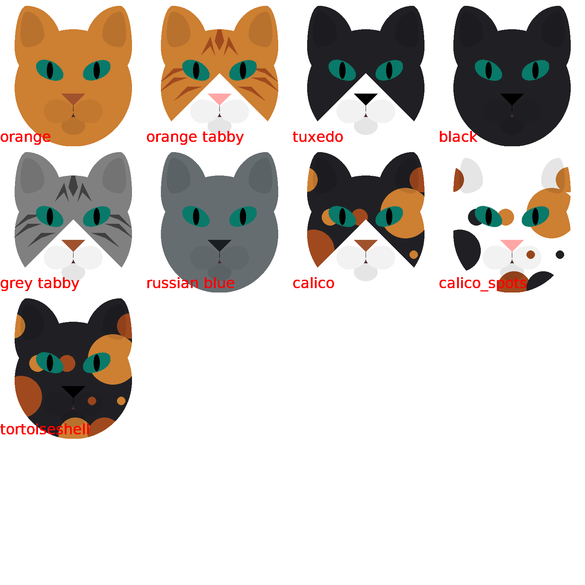

# Cat

## Graphs

# TODO

  * Add brown tabby
  * Allow custom neck color
  * Add paws
  * Add special things

# Development log

This code was written in increments. Each step was either the adding of a new feature or the reorganizing of code to make it cleaer, simpler or more flexible.

  1. At the very start, sketch the cat on paper to get proportions
  2. Draw the cat directly with pillow (as a one-way script, no functions)
  3. Start adding a few functions
  4. Develop the class system
  5. Switch back to rework the coordinate system (resizing made generate slow; though that might not have really been the case)
  6. Add breeds and moods
  7. Switch back to the classes to make their shapes dependent on the moods
  8. Start work on the graphs as one-way scripts with a few functions
  9. Switch back to the moods to allow them to blend into each other (this is for the heatmap)
  10. [Now] continue to work on the graphs, generalize them
